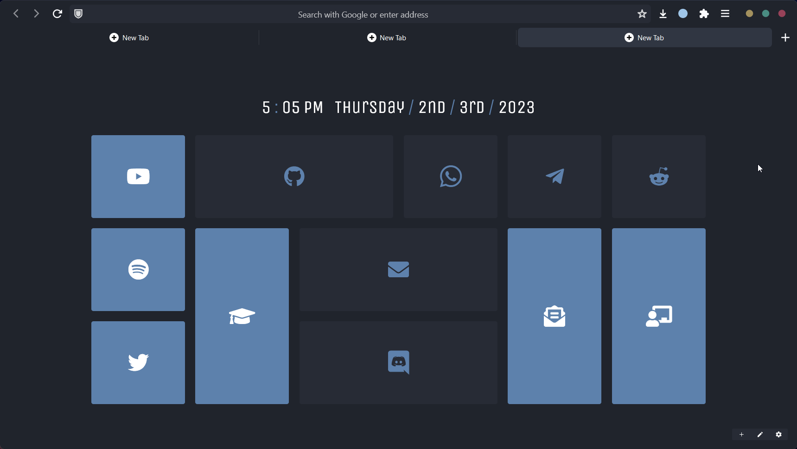

# LunarFox
neat lil' firefox theme
## UI
## How It Looks

    

## Based on 
 <a href="https://github.com/QNetITQ/WaveFox">
  Wave Fox
 </a> 
and
 <a href="https://github.com/witalihirsch/Mono-firefox-theme">
  Mono
 </a> 
 
## Installing
1. Go to `about:profiles` in Firefox.
2. Go to "Root Directory".
4. Put the "chrome" folder in there
5. Set `toolkit.legacyUserProfileCustomizations.stylesheets` in `about:config` to `true`.
6. Restart Firefox.

 
